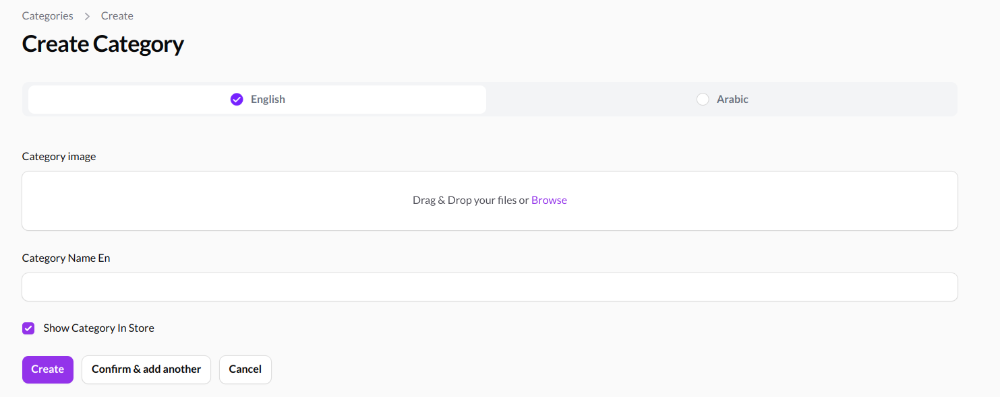

# A filament field that handles translations

This package enables you to implement the following:



1. Render a language selector to change the localized filed
2. You can save your localized fields data in one click
   ![]
3. You can use it in your relationship manager to

This package depends on [spatie/laravel-translatable](https://github.com/spatie/laravel-translatable), Please check it first to set up your translation logic in your project.
## Installation

You can install the package via composer:

```bash
composer require 34ml/filament-translatable-field
```

You can publish the config file with:

```bash
php artisan vendor:publish --tag="filament-translatable-field-config"
```

This is the contents of the published config file which the fields are created for each language listed here:

```php
return [
    'locales' => [
        'en' => 'English',
        'ar' => 'Arabic',
    ],
    'select_translation_field_name' => 'select_language',
];
```

## Usage
### Translatable Field
Just add the field in your resource, view, create,or edit pages inside the form function
```php
 ..._34ML\FilamentTranslatableField::make(
 'your_translatable_field_name',
 \Filament\Forms\Components\TextInput::class, // The field type class 
 'your_field_displayed_name', // Optional
// add your filament field functions as a callback 
// you can add it as one function
callbacks: function (){
    $this->required();
    $this->numeric();
    return $this; // You have to return the field or the callbacks won't work
}

// it also works as an array of different functions
callbacks: [
function(){
    return $this->required();
},
function(){
    return $this->numeric();
}
]);
```

### Language Selector
If you want to add a language selector that shows only the select language's fields instead of showing all fields 
you can simply add this field in your resource, view, create,or edit pages inside the form function

```php
use _34ML\FilamentTranslatableField\Forms\Components\LanguageSelector;

return $form
           ->schema([
               LanguageSelector::make(),
                ]);
```
## Relationship Manager
you need to add this code to your relationship manager
```php
    public static function getRecordTitle(?Model $record): ?string
    {
        return $record->getTranslation('your_title_column', config('filament-translatable-field.locales')[0]);
    }
```
## Credits

- [Mostafa Hassan](https://github.com/MostafaHassan1)
- [Reham Mourad](https://github.com/RehamMourad)
- [Ahmed Essam](https://github.com/aessam13)

## License

The MIT License (MIT). Please see [License File](LICENSE.md) for more information.

